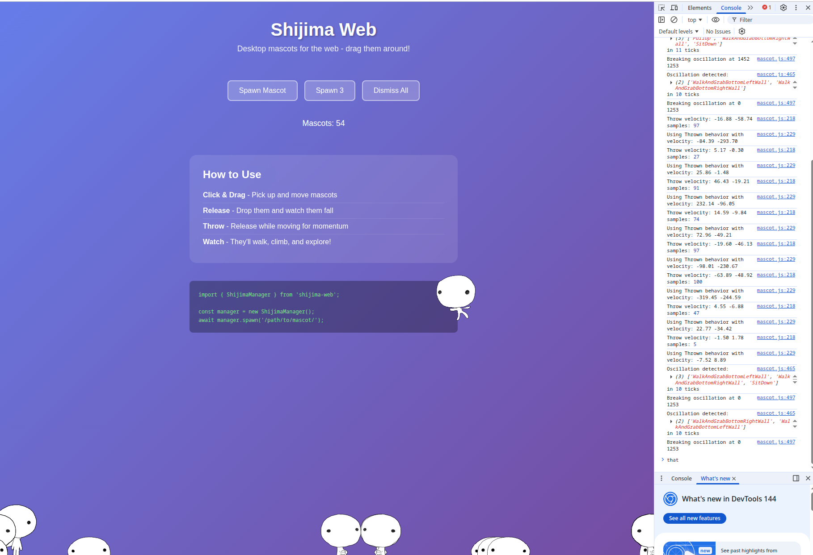

# Shijima Web

Desktop mascots for the web! A JavaScript library that brings animated mascot characters to your website. Based on the [Shijima-Qt](https://github.com/pixelomer/Shijima-Qt) desktop application.



## Features

- Animated mascot characters that walk, fall, climb, and explore your page
- Drag and drop interaction - pick up and throw mascots
- Physics simulation with gravity and collision detection
- Right-click context menu for mascot control
- Compatible with Shimeji mascot format (XML behaviors + PNG sprites)
- Pure JavaScript - no dependencies, no WebAssembly
- Lightweight (~15KB minified)

## Quick Start

### Using ES Modules

```html
<script type="module">
  import { ShijimaManager } from 'shijima-web';

  const manager = new ShijimaManager();
  await manager.spawn('/path/to/mascot/');
</script>
```

### Using Script Tag

```html
<script src="https://unpkg.com/shijima-web/dist/shijima.min.js"></script>
<script>
  const manager = new Shijima.ShijimaManager();
  manager.spawn('/path/to/mascot/');
</script>
```

## Demo

Run the demo locally:

```bash
npm install
npm run serve
```

Then open http://localhost:8080/demo/ in your browser.

## Mascot Format

Mascots are directories containing:

```
mascot/
├── behaviors.xml   # Behavior state machine
├── actions.xml     # Animation definitions
└── img/
    ├── shime1.png  # Animation frames
    ├── shime2.png
    └── ...
```

The format is compatible with Shimeji mascots. A default mascot is included in `demo/mascot/`.

## API Reference

### ShijimaManager

The main class for managing mascots.

```javascript
const manager = new ShijimaManager(options);
```

**Options:**

| Option | Type | Default | Description |
|--------|------|---------|-------------|
| `container` | HTMLElement | `document.body` | DOM element to contain mascots |
| `tickInterval` | number | `40` | Animation tick interval in ms |
| `allowBreeding` | boolean | `true` | Allow mascots to duplicate/breed |
| `maxMascots` | number | `Infinity` | Maximum number of mascots allowed |

**Examples:**

```javascript
// Basic setup
const manager = new ShijimaManager();

// Single mascot only (no duplication)
const manager = new ShijimaManager({
  allowBreeding: false
});

// Limit to 5 mascots maximum
const manager = new ShijimaManager({
  maxMascots: 5
});

// Custom container
const manager = new ShijimaManager({
  container: document.getElementById('mascot-area')
});
```

**Methods:**

```javascript
// Spawn a mascot from a URL
await manager.spawn(mascotUrl, {
  x: 100,           // Initial X position
  y: 0,             // Initial Y position
  behavior: 'Fall', // Initial behavior
  lookingRight: true
});

// Dismiss all mascots
manager.dismissAll();

// Dismiss a specific mascot
manager.dismiss(mascot);

// Stop animation loop
manager.stop();

// Start animation loop
manager.start();

// Get mascot count
console.log(manager.count);

// Destroy manager and clean up
manager.destroy();
```

### Mascot

Individual mascot instances.

```javascript
// Get current position
console.log(mascot.anchor.x, mascot.anchor.y);

// Check direction
console.log(mascot.lookingRight);

// Force a behavior
mascot.setBehavior('Walk');

// Remove mascot
mascot.destroy();
```

### Quick Setup

```javascript
import { createShijima } from 'shijima-web';

// One-liner to create manager and spawn a mascot
const manager = await createShijima('/mascot/', { x: 100, y: 0 });
```

## Creating Custom Mascots

### behaviors.xml

Defines the behavior state machine:

```xml
<?xml version="1.0" encoding="UTF-8"?>
<Mascot>
  <BehaviorList>
    <Behavior Name="Fall" Frequency="0">
      <ActionReference Name="Fall"/>
      <NextBehaviorList Add="true">
        <BehaviorReference Name="Walk" Frequency="1"/>
        <BehaviorReference Name="Sit" Frequency="1"/>
      </NextBehaviorList>
    </Behavior>

    <Behavior Name="Walk" Frequency="1">
      <ActionReference Name="Walk"/>
    </Behavior>
  </BehaviorList>
</Mascot>
```

### actions.xml

Defines animations and movement:

```xml
<?xml version="1.0" encoding="UTF-8"?>
<Mascot>
  <ActionList>
    <Action Name="Fall" Type="Fall" Gravity="2" RegistanceX="0.05" RegistanceY="0.1">
      <Animation>
        <Pose Image="fall1.png" ImageAnchor="64,128" Duration="5"/>
        <Pose Image="fall2.png" ImageAnchor="64,128" Duration="5"/>
      </Animation>
    </Action>

    <Action Name="Walk" Type="Move" BorderType="Floor">
      <Animation>
        <Pose Image="walk1.png" ImageAnchor="64,128" Velocity="-3,0" Duration="5"/>
        <Pose Image="walk2.png" ImageAnchor="64,128" Velocity="-3,0" Duration="5"/>
      </Animation>
    </Action>
  </ActionList>
</Mascot>
```

## Building

```bash
# Install dependencies
npm install

# Build all formats
npm run build:all

# Individual builds
npm run build       # IIFE (browser global)
npm run build:esm   # ES Module
npm run build:cjs   # CommonJS
npm run build:min   # Minified IIFE
```

## Browser Support

- Chrome 80+
- Firefox 75+
- Safari 13.1+
- Edge 80+

## License

GPL-3.0

## Credits

- Based on [Shijima-Qt](https://github.com/pixelomer/Shijima-Qt) by pixelomer
- Inspired by the original [Shimeji](https://kilkakon.com/shimeji/) desktop mascot
